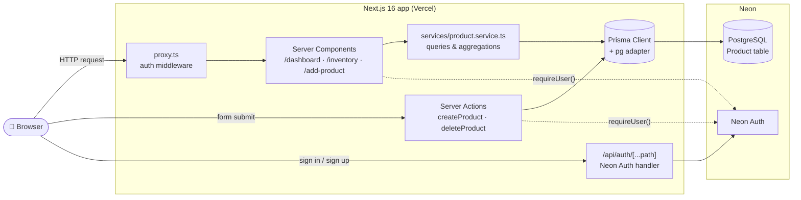
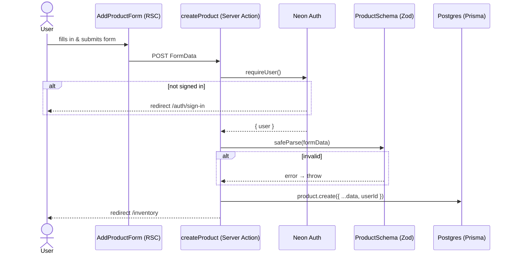
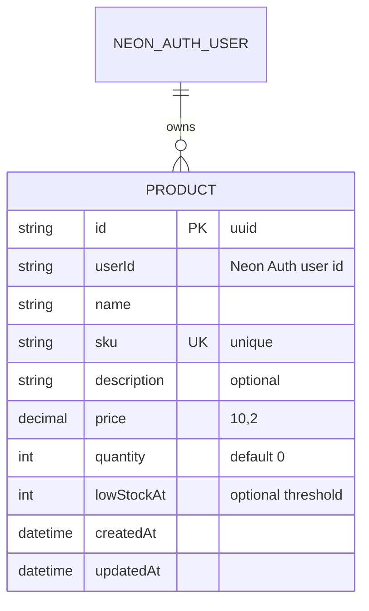
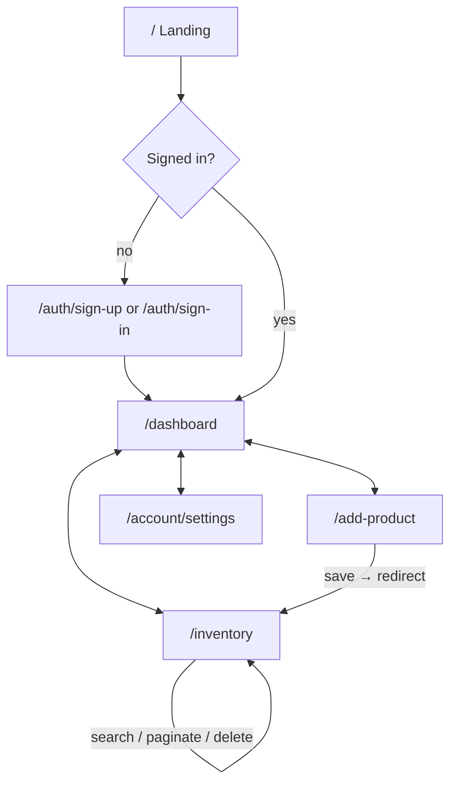
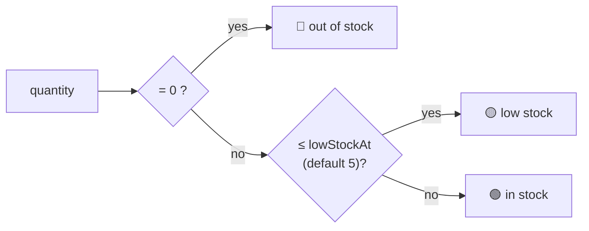

# 📦 Web Inventory Management

A full-stack inventory management web app built with **Next.js 16 (App Router)**, **React 19 Server Components**, **Prisma 7** and **Neon** (serverless Postgres + Neon Auth).

Users sign up, add products to their own private inventory, search and paginate through them, and see a dashboard with key metrics, a weekly “new products” chart and a stock-health pie chart.

> 🔗 **Live demo:** _coming soon — see [Deployment](#-deployment)_
>
> To try it, open the demo, click **Sign Up**, create an account (email/password or Google/GitHub), then add a few products. Every user only sees their own data.

---

## Table of contents

- [Features](#-features)
- [Tech stack](#-tech-stack)
- [Architecture](#-architecture)
- [Data model](#-data-model)
- [Pages & user flow](#-pages--user-flow)
- [Business rules](#-business-rules)
- [Project structure](#-project-structure)
- [Getting started (local)](#-getting-started-local)
- [Deployment](#-deployment)
- [Scripts](#-scripts)
- [Known limitations / roadmap](#-known-limitations--roadmap)

---

## ✨ Features

| Area                  | What you can do                                                                                                                                                                                                                                    |
| --------------------- | -------------------------------------------------------------------------------------------------------------------------------------------------------------------------------------------------------------------------------------------------- |
| **Authentication**    | Sign up / sign in with email + password, email OTP, or Google / GitHub / Vercel OAuth. Forgot password, “remember me”, account settings page. Powered by **Neon Auth**.                                                                            |
| **Dashboard**         | Inventory metrics (total products, total inventory value, low-stock count), a 12-week **area chart** of newly added products, the 5 most recent products with stock status, and an **efficiency pie chart** (in stock / low stock / out of stock). |
| **Inventory**         | Server-rendered products table with **search by any field** (name, SKU, description, price, quantity, low-stock threshold, created/updated date), **pagination** (10 per page) and **delete**.                                                     |
| **Add product**       | Form with HTML + **Zod** server-side validation, handled by a **Server Action**.                                                                                                                                                                   |
| **Multi-tenant data** | Every query is scoped by the signed-in user’s id — users never see each other’s products.                                                                                                                                                          |
| **Route protection**  | Next.js proxy (middleware) + server-side `requireUser()` guard in every protected layout.                                                                                                                                                          |

---

## 🛠 Tech stack

| Layer              | Technology                                                                                                                                    |
| ------------------ | --------------------------------------------------------------------------------------------------------------------------------------------- |
| Framework          | [Next.js 16](https://nextjs.org) (App Router, Turbopack, React Compiler)                                                                      |
| UI                 | [React 19](https://react.dev) Server & Client Components, [Tailwind CSS 4](https://tailwindcss.com), [lucide-react](https://lucide.dev) icons |
| Charts             | [Recharts 3](https://recharts.org)                                                                                                            |
| Auth               | [Neon Auth](https://neon.com/docs/auth/overview) (`@neondatabase/auth`) — prebuilt sign-in / sign-up / account UI                             |
| Database           | [Neon](https://neon.com) serverless PostgreSQL                                                                                                |
| ORM                | [Prisma 7](https://www.prisma.io) with the `@prisma/adapter-pg` driver adapter                                                                |
| Validation         | [Zod 4](https://zod.dev)                                                                                                                      |
| Language & tooling | TypeScript 5, ESLint 9, Prettier (+ Tailwind plugin)                                                                                          |
| Hosting            | [Vercel](https://vercel.com)                                                                                                                  |

---

## 🏗 Architecture

The app is almost entirely **server-rendered**. Pages are async React Server Components that read from Postgres via Prisma; mutations go through **Server Actions**, so there’s no separate REST API for products.



### Request lifecycle — adding a product



---

## 🗄 Data model

A single `Product` table; the owner is referenced by the Neon Auth user id.



Indexes: `(userId, name)` and `(createdAt)`. Schema: [`prisma/schema.prisma`](prisma/schema.prisma).

---

## 🧭 Pages & user flow

| Route                               | Access | Description                                                      |
| ----------------------------------- | ------ | ---------------------------------------------------------------- |
| `/`                                 | public | Landing page with Sign In / Sign Up                              |
| `/auth/sign-in`, `/auth/sign-up`, … | public | Neon Auth prebuilt auth views                                    |
| `/dashboard`                        | 🔒     | Metrics, weekly chart, stock levels, efficiency pie              |
| `/inventory`                        | 🔒     | Search, paginate and delete products (`?query=&searchBy=&page=`) |
| `/add-product`                      | 🔒     | Create a product                                                 |
| `/account/settings`                 | 🔒     | Profile, password, sessions (Neon Auth account view)             |
| `/api/auth/[...path]`               | —      | Neon Auth API handler                                            |



### Suggested walkthrough for reviewers

1. **Sign up** on the landing page.
2. Go to **Add Product** and create 5–10 products. Vary the quantities: use `0` for some, a value at or below the low-stock threshold for others, and larger values for the rest.
3. Open **Inventory**. Search by name, then switch _Search by_ to **Price** or **Created At** to see the input type change. Delete a product.
4. Open **Dashboard**. The metrics, weekly chart, stock-level badges and efficiency pie all update from your data.
5. Open **Settings** to see the account management UI.

---

## 📏 Business rules

Stock status is computed in [`lib/getStockStatus.ts`](lib/getStockStatus.ts):



- **Total inventory value** = Σ `price × quantity` over the user’s products.
- **Weekly chart** buckets products by `createdAt` into the last 12 weeks.
- **Search** uses case-insensitive `contains` for text fields, exact match for numeric fields, and `>=` for date fields.

---

## 📁 Project structure

```
app/                     # Next.js App Router
├─ page.tsx              # landing page
├─ dashboard/            # dashboard page + protected layout
├─ inventory/            # products table page
├─ add-product/          # create product page
├─ account/[path]/       # Neon Auth account views
├─ auth/[path]/          # Neon Auth sign-in / sign-up views
├─ api/auth/[...path]/   # Neon Auth route handler
└─ providers.tsx         # NeonAuthUIProvider
components/              # UI, split into feature folders with nested `parts/`
├─ Dashboard/  Inventory/  AddProductForm/  Sidebar/  ui/
lib/
├─ actions/products.ts   # Server Actions (create / delete)
├─ auth/                 # Neon Auth server + client helpers, requireUser()
├─ prisma.ts             # Prisma client singleton (pg adapter)
└─ get*.ts               # pure helpers (stock status, weekly buckets, pagination)
services/product.service.ts  # data-access layer (counts, aggregations, filters)
prisma/                  # schema, migrations, seed script
constants/  types/  zod/ # shared constants, TS types, validation schemas
proxy.ts                 # auth middleware (Next.js 16 "proxy")
```

---

## 🚀 Getting started (local)

### Prerequisites

- Node.js **20+**
- A free [Neon](https://neon.com) project with **Neon Auth enabled**

### 1. Clone & install

```bash
git clone https://github.com/nazaruha/web_inventory_management.git
cd web_inventory_management
npm install          # also runs `prisma generate` (postinstall)
```

### 2. Configure environment

```bash
cp .env.example .env
```

| Variable                  | Where to get it                                             |
| ------------------------- | ----------------------------------------------------------- |
| `DATABASE_URL`            | Neon Console → **Connect** → connection string              |
| `NEON_AUTH_BASE_URL`      | Neon Console → **Auth** → configuration                     |
| `NEON_AUTH_COOKIE_SECRET` | any random 32+ character string (`openssl rand -base64 32`) |

### 3. Create the database schema

```bash
npx prisma migrate deploy
```

Optional: seed 23 demo products. Set `userId` in [`prisma/seed.ts`](prisma/seed.ts) to your Neon Auth user id first. You can find it at `/server-rendered-page` after signing in.

```bash
npx prisma db seed
```

### 4. Run

```bash
npm run dev
```

Open <http://localhost:3000>.

---

## ☁️ Deployment

The app is deployed on **Vercel**, with the database and auth on **Neon**.

1. Go to [vercel.com/new](https://vercel.com/new) and import the GitHub repository. Vercel detects the Next.js framework automatically.
2. Add the three environment variables from `.env.example` (`DATABASE_URL`, `NEON_AUTH_BASE_URL`, `NEON_AUTH_COOKIE_SECRET`).
3. Click **Deploy**. `npm install` triggers `prisma generate` through the `postinstall` script, and then `next build` runs.
4. In the **Neon Console → Auth → Configuration**, add the Vercel domain (e.g. `https://your-app.vercel.app`) to the trusted domains. Without this step, sign-in is rejected in production.
5. Run `npx prisma migrate deploy` once against the production `DATABASE_URL`. This isn't needed if production uses the same Neon database you already migrated.

[](https://vercel.com/new/clone?repository-url=https%3A%2F%2Fgithub.com%2Fnazaruha%2Fweb_inventory_management&env=DATABASE_URL,NEON_AUTH_BASE_URL,NEON_AUTH_COOKIE_SECRET)

---

## 📜 Scripts

| Command                           | Description                      |
| --------------------------------- | -------------------------------- |
| `npm run dev`                     | Start the dev server (Turbopack) |
| `npm run build`                   | Production build                 |
| `npm start`                       | Serve the production build       |
| `npm run lint`                    | ESLint                           |
| `npm run format` / `format:check` | Prettier write / check           |
| `npx prisma studio`               | Browse the database in a GUI     |

---

## 🧩 Known limitations / roadmap

- Products can be created and deleted but not **edited** yet.
- The layout is desktop-first (fixed sidebar); mobile layout is not yet optimized.
- No automated tests yet.
- `/client-rendered-page`, `/server-rendered-page` and `/api/secure-api-route` are Neon Auth demo routes that show the current session. They're kept for debugging.
